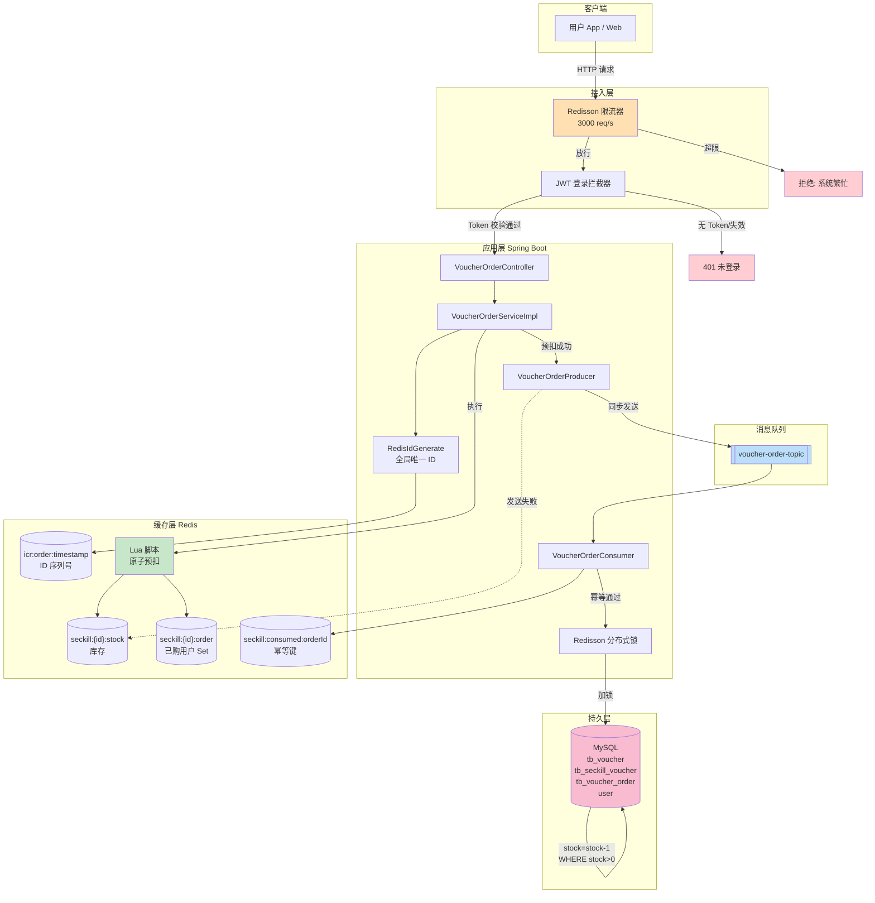
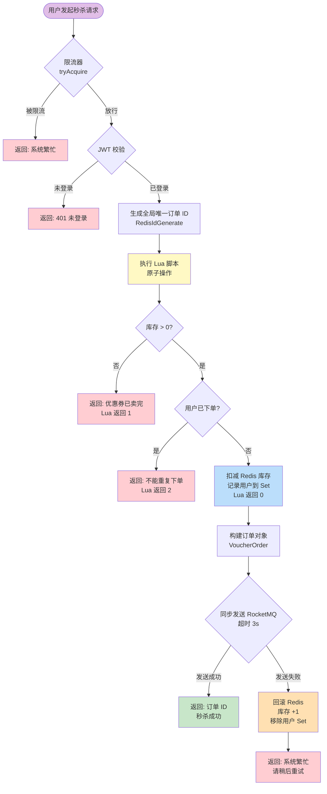
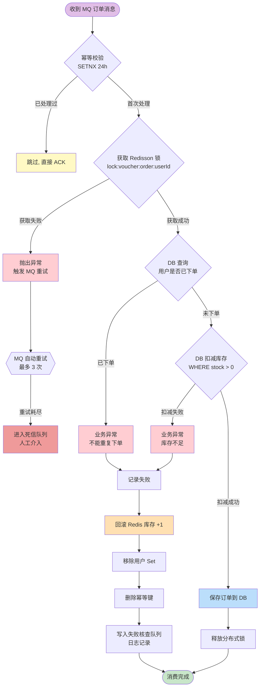

---

<div align="center">

# ⚡ FlashDeal

### 高并发秒杀系统 | High-Concurrency Flash Sale System

基于 **Spring Boot 3 + Redis + RocketMQ** 构建的高可用、防超卖、防重复下单的秒杀系统

[](https://openjdk.org/)
[](https://spring.io/projects/spring-boot)
[](https://redis.io/)
[](https://rocketmq.apache.org/)
[](https://baomidou.com/)
[](LICENSE)

</div>

---

## 📖 项目简介

**FlashDeal** 是一个面向高并发场景的秒杀系统，核心解决电商促销、限量抢购等业务中常见的三大难题：**超卖**、**重复下单**、**流量洪峰**。系统通过 Redis Lua 脚本实现原子性库存预扣减，借助 RocketMQ 完成订单异步落库，并使用 Redisson 分布式锁与限流器保障数据一致性与系统稳定性。

整体设计遵循"**前置拦截 → 原子预扣 → 异步落库 → 失败补偿**"的分层防御理念，单机可支撑每秒数千次秒杀请求，在保证业务正确性的同时最大化吞吐能力。项目代码结构清晰、注释完善，既可作为生产级秒杀方案的参考实现，也适合作为学习高并发架构设计的实战案例。

---

## ✨ 核心特性

| 特性 | 实现方式 | 说明 |
| :--- | :--- | :--- |
| 🚀 **流量整形** | Redisson `RRateLimiter` | 全局限流 3000 req/s，超出直接拒绝，保护后端 |
| 🔐 **登录鉴权** | JWT + 拦截器 | 无状态认证，Token 有效期 2 小时 |
| ⚡ **原子预扣** | Redis Lua 脚本 | 库存校验 + 扣减 + 去重三步原子完成，避免竞态 |
| 🆔 **全局唯一 ID** | Hutool Snowflake | 本地生成、趋势递增、支持分布式（预留 workerId） |
| 📨 **异步落库** | RocketMQ 同步发送 | Redis 预扣成功后异步写 DB，发送失败自动回滚 Redis |
| 🔒 **分布式锁** | Redisson `RLock` | 按用户加锁，DB 层兜底防重复下单 |
| 🛡️ **幂等消费** | Redis `SETNX` | 消费端 24 小时幂等键，防止 MQ 重投导致重复处理 |
| 💥 **超卖防御** | DB 乐观锁 `stock > 0` | `UPDATE ... SET stock = stock - 1 WHERE stock > 0` |
| 🔄 **失败补偿** | Redis 回滚 + 失败队列 | MQ 发送失败 / 消费业务异常时自动回滚库存 |

---

## 🛠️ 技术栈

| 分类 | 技术 | 版本 |
| :--- | :--- | :--- |
| **基础框架** | Spring Boot | 3.5.16 |
| **开发语言** | Java | 17 |
| **ORM 框架** | MyBatis Plus | 3.5.8 |
| **关系型数据库** | MySQL | 8.0+ |
| **缓存中间件** | Redis | 7.0+ |
| **分布式锁/限流** | Redisson | 3.27.0 |
| **消息队列** | Apache RocketMQ | 4.9.7 |
| **认证授权** | JWT | 0.12.6 |
| **工具库** | Lombok | -- |

---

## 🏗️ 系统架构

下图展示了 FlashDeal 的整体架构与各组件协作关系。客户端请求经过限流器与登录拦截器后进入业务层，业务层通过 Redis 完成原子预扣，再通过 RocketMQ 异步落库，最终由消费者在分布式锁保护下写入 MySQL。



---

## ⚡ 秒杀核心流程

下图展示了从用户点击"立即抢购"到订单创建完成的完整链路，包含限流、鉴权、Lua 原子预扣、MQ 异步发送、失败回滚等关键环节。这是整个系统最核心的流程，所有的高并发设计都集中体现在这里。



---

## 📨 MQ 消费与补偿流程

下图展示了 RocketMQ 消费者侧的处理逻辑。消费者收到订单消息后，先做幂等校验，再在分布式锁保护下完成 DB 落库。若发生业务异常（如库存不足、重复下单），会自动回滚 Redis 预扣的库存，保证 Redis 与 DB 数据最终一致。



---

## 📁 项目结构

```
FlashDeal
├── pom.xml                                      # Maven 依赖与构建配置
├── src
│   ├── main
│   │   ├── java/com/flashdeal
│   │   │   ├── FlashDealApplication.java        # 启动类
│   │   │   ├── controller/                      # 控制层
│   │   │   │   ├── UserController.java          # 用户登录
│   │   │   │   ├── VoucherOrderController.java  # 秒杀下单入口
│   │   │   │   └── TestController.java          # 测试: 添加秒杀券
│   │   │   ├── service/                         # 服务层
│   │   │   │   ├── UserService.java
│   │   │   │   ├── IVoucherService.java
│   │   │   │   ├── ISeckillVoucherService.java
│   │   │   │   ├── IVoucherOrderService.java
│   │   │   │   └── impl/
│   │   │   │       ├── UserServiceImpl.java
│   │   │   │       ├── VoucherServiceImpl.java          # 添加秒杀券+同步库存到Redis
│   │   │   │       ├── SeckillVoucherServiceImpl.java
│   │   │   │       └── VoucherOrderServiceImpl.java     # ⭐ 秒杀核心逻辑
│   │   │   ├── rocketmq/                        # MQ 生产/消费
│   │   │   │   ├── VoucherOrderProducer.java    # 同步发送+补偿队列
│   │   │   │   ├── VoucherOrderConsumer.java    # 幂等消费+失败回滚
│   │   │   │   └── SeckillFailRecord.java       # 失败记录占位类
│   │   │   ├── mapper/                          # MyBatis Plus Mapper
│   │   │   ├── domain/                          # 实体与 DTO/VO
│   │   │   │   ├── User.java
│   │   │   │   ├── Voucher.java
│   │   │   │   ├── SeckillVoucher.java
│   │   │   │   ├── VoucherOrder.java
│   │   │   │   ├── Result.java                  # 统一返回结果
│   │   │   │   ├── dto/UserLoginDTO.java
│   │   │   │   └── vo/UserLoginVO.java
│   │   │   └── common/                          # 公共组件
│   │   │       ├── config/                      # 配置类
│   │   │       │   ├── RedisConfig.java
│   │   │       │   ├── RedissonConfig.java
│   │   │       │   ├── MybatisPlusConfig.java
│   │   │       │   └── WebMvcConfig.java        # 拦截器+消息转换器
│   │   │       ├── constant/                    # 常量
│   │   │       │   ├── RedisKeyConstant.java
│   │   │       │   ├── MessageConstant.java
│   │   │       │   └── JwtClaimsConstant.java
│   │   │       ├── exception/                   # 异常处理
│   │   │       │   ├── BaseException.java
│   │   │       │   ├── BusinessException.java
│   │   │       │   ├── LoginFailedException.java
│   │   │       │   └── GlobalExceptionHandler.java
│   │   │       ├── interceptor/                 # JWT 登录拦截器
│   │   │       │   └── LoginInterceptor.java
│   │   │       ├── utils/                       # 工具类
│   │   │       │   ├── JwtUtil.java
│   │   │       │   ├── RedisIdGenerate.java     # 全局唯一 ID 生成器
│   │   │       │   ├── LuaScriptUtil.java       # Lua 脚本加载器
│   │   │       │   └── UserHolder.java          # ThreadLocal 用户上下文
│   │   │       ├── properties/JwtProperties.java
│   │   │       └── json/JacksonObjectMapper.java
│   │   └── resources/
│   │       ├── application.yaml                 # 应用配置
│   │       ├── mapper/UserMapper.xml
│   │       └── lua/seckill.lua                  # ⭐ 秒杀 Lua 脚本
│   └── test/java/com/flashdeal/FlashDealApplicationTests.java
```

---

## 🚀 快速开始

### 环境准备

| 依赖 | 最低版本 | 说明 |
| :--- | :--- | :--- |
| JDK | 17 | 必须 |
| Maven | 3.8+ | 构建工具 |
| MySQL | 8.0+ | 数据存储 |
| Redis | 7.0+ | 缓存与分布式锁 |
| RocketMQ | 4.9.7 | 消息队列 |

### 1. 初始化数据库

```sql
-- 用户表
CREATE TABLE `user` (
  `id` BIGINT NOT NULL AUTO_INCREMENT,
  `openid` VARCHAR(64) DEFAULT NULL,
  `name` VARCHAR(64) DEFAULT NULL,
  `phone` VARCHAR(32) DEFAULT NULL,
  `sex` VARCHAR(4) DEFAULT NULL,
  `id_number` VARCHAR(32) DEFAULT NULL,
  `avatar` VARCHAR(255) DEFAULT NULL,
  `create_time` DATETIME DEFAULT NULL,
  PRIMARY KEY (`id`),
  UNIQUE KEY `uk_phone` (`phone`)
) ENGINE=InnoDB DEFAULT CHARSET=utf8mb4;

-- 优惠券表
CREATE TABLE `tb_voucher` (
  `id` BIGINT NOT NULL AUTO_INCREMENT,
  `title` VARCHAR(128) DEFAULT NULL,
  `sub_title` VARCHAR(128) DEFAULT NULL,
  `rules` VARCHAR(1024) DEFAULT NULL,
  `pay_value` BIGINT DEFAULT NULL,
  `actual_value` BIGINT DEFAULT NULL,
  `type` INT DEFAULT NULL,
  `status` INT DEFAULT NULL,
  `create_time` DATETIME DEFAULT NULL,
  `update_time` DATETIME DEFAULT NULL,
  PRIMARY KEY (`id`)
) ENGINE=InnoDB DEFAULT CHARSET=utf8mb4;

-- 秒杀优惠券表
CREATE TABLE `tb_seckill_voucher` (
  `voucher_id` BIGINT NOT NULL,
  `stock` INT NOT NULL,
  `create_time` DATETIME DEFAULT NULL,
  `begin_time` DATETIME DEFAULT NULL,
  `end_time` DATETIME DEFAULT NULL,
  `update_time` DATETIME DEFAULT NULL,
  PRIMARY KEY (`voucher_id`)
) ENGINE=InnoDB DEFAULT CHARSET=utf8mb4;

-- 优惠券订单表
CREATE TABLE `tb_voucher_order` (
  `id` BIGINT NOT NULL,
  `user_id` BIGINT NOT NULL,
  `voucher_id` BIGINT NOT NULL,
  `pay_type` INT DEFAULT NULL,
  `status` INT DEFAULT NULL,
  `create_time` DATETIME DEFAULT NULL,
  `pay_time` DATETIME DEFAULT NULL,
  `use_time` DATETIME DEFAULT NULL,
  `refund_time` DATETIME DEFAULT NULL,
  `update_time` DATETIME DEFAULT NULL,
  PRIMARY KEY (`id`),
  UNIQUE KEY `uk_user_voucher` (`user_id`, `voucher_id`)
) ENGINE=InnoDB DEFAULT CHARSET=utf8mb4;
```

### 2. 修改配置

编辑 `src/main/resources/application.yaml`，按实际环境调整 MySQL、Redis、RocketMQ 地址：

```yaml
spring:
  datasource:
    url: jdbc:mysql://localhost:3306/flashdeal?sslMode=DISABLED&serverTimezone=Asia/Shanghai
    username: root
    password: your_password
    driver-class-name: com.mysql.cj.jdbc.Driver
  data:
    redis:
      host: localhost
      port: 6379
      database: 0

rocketmq:
  name-server: localhost:9876
  producer:
    group: voucherorder_group
```

### 3. 启动中间件

```bash
# 启动 Redis
redis-server --daemonize yes

# 启动 RocketMQ NameServer 与 Broker（需在 RocketMQ 安装目录执行）
nohup sh bin/mqnamesrv &
nohup sh bin/mqbroker -n localhost:9876 &
```

### 4. 构建与运行

```bash
# 编译打包
mvn clean package -DskipTests

# 运行
java -jar target/FlashDeal-1.0.0.jar

# 或开发模式
mvn spring-boot:run
```

应用启动后监听 **8080** 端口。

---

## 📡 接口文档

### 用户登录

```http
POST /user/user/login
Content-Type: application/json

{
  "phone": "13800138000"
}
```

**响应示例：**

```json
{
  "code": 1,
  "msg": null,
  "data": {
    "id": 1,
    "phone": "13800138000",
    "token": "eyJhbGciOiJIUzI1NiJ9..."
  }
}
```

### 添加秒杀优惠券（测试用）

```http
POST /test/voucher/seckill
Content-Type: application/json

{
  "title": "100元代金券",
  "subTitle": "限时秒杀",
  "payValue": 8000,
  "actualValue": 10000,
  "type": 1,
  "status": 1,
  "stock": 100,
  "beginTime": "2026-06-29T10:00:00",
  "endTime": "2026-06-29T12:00:00"
}
```

### 秒杀下单（核心接口）

```http
POST /user/voucher-order/seckill/{id}
Authorization: Bearer <登录返回的 token>
```

**响应示例：**

```json
// 成功
{ "code": 1, "msg": null, "data": 1780001234567890 }

// 库存不足
{ "code": 0, "msg": "优惠券已卖完", "data": null }

// 重复下单
{ "code": 0, "msg": "不能重复下单", "data": null }

// 限流/系统繁忙
{ "code": 0, "msg": "当前系统繁忙，请稍后重试", "data": null }
```

---

## 🔑 关键设计解析

### 1. Lua 脚本原子预扣

秒杀场景下，"判断库存 → 扣减库存 → 记录用户"这三步如果分开执行，会出现并发竞态。本项目通过 Lua 脚本将三步合并为一次原子操作，Redis 单线程执行保证不会被打断：

```lua
-- lua/seckill.lua
if (tonumber(redis.call('get', stockKey) or 0) <= 0) then
    return 1                          -- 库存不足
end
if (redis.call('sismember', orderKey, userId) == 1) then
    return 2                          -- 重复下单
end
redis.call('decr', stockKey)          -- 扣减库存
redis.call('sadd', orderKey, userId)  -- 记录用户
return 0                              -- 成功
```

### 2. 全局唯一订单 ID

订单 ID 不能用 MySQL 自增（分库分表场景会冲突），也不能用 UUID（无序，影响 B+ 树插入性能）。本项目采用 **时间戳 + 序列号** 的 64 位 ID 方案：

```
|  32 bit 时间戳  |  32 bit 自增序列号  |
```

- 高 32 位：当前时间距基准时间（2026-01-01）的秒数，趋势递增
- 低 32 位：Redis `INCR` 同一秒内的自增序号

### 3. Redis 与 DB 最终一致性

系统采用"**Redis 预扣 + MQ 异步落库**"模式，Redis 是库存的"快"视图，DB 是"真"数据源。一致性保障措施：

- **MQ 同步发送**：发送成功才返回用户成功，发送失败立即回滚 Redis
- **消费端幂等**：`SETNX` 24 小时幂等键，防止 MQ 重投
- **分布式锁兜底**：按用户加锁，DB 层再次校验防重复
- **业务异常回滚**：消费失败时回滚 Redis 库存，保证不"少卖"

### 4. 分层限流防雪崩

- **第一层**：Redisson `RRateLimiter` 全局限流 3000 req/s，超出直接返回"系统繁忙"
- **第二层**：Redis Lua 脚本快速拒绝无库存/重复请求，不进入 MQ
- **第三层**：DB 乐观锁 `WHERE stock > 0` 兜底防超卖

---

## 📊 性能指标

| 指标 | 数值 | 说明 |
| :--- | :--- | :--- |
| 单机 QPS | ~3000 | 受限流器配置约束 |
| 平均响应时间 | < 50ms | Redis 预扣 + MQ 同步发送 |
| wrk 压测 | 100 并发，630K+ 请求，P99 < 7ms | 本地 benchmark 参考数据 |
| 超卖防护 | 理论可完全避免 | Lua 原子操作 + DB 乐观锁双重保障 |
| 重复下单防护 | 理论可完全避免 | Redis Set + 分布式锁 + DB 唯一索引 |

---

## 🗺️ 路线图

- [x] 用户登录与 JWT 鉴权
- [x] 秒杀优惠券管理
- [x] Redis Lua 原子预扣
- [x] RocketMQ 异步落库
- [x] 分布式锁防重复
- [x] 失败补偿与回滚
- [ ] 接口压测脚本（JMeter）
- [ ] Docker Compose 一键部署
- [ ] Prometheus + Grafana 监控
- [ ] 秒杀券预热与活动管理后台

---

## 📄 License

本项目基于 [MIT License](LICENSE) 开源，欢迎学习、交流与二次开发。

---

<div align="center">

**如果这个项目对你有帮助，欢迎 ⭐ Star 支持！**

</div>
