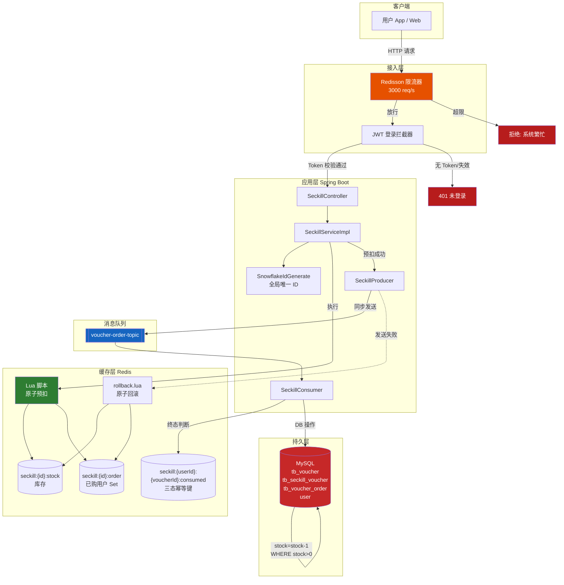
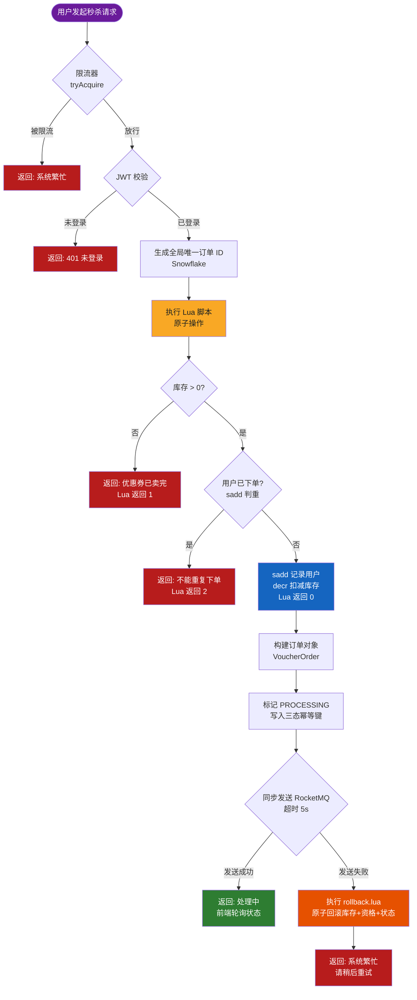
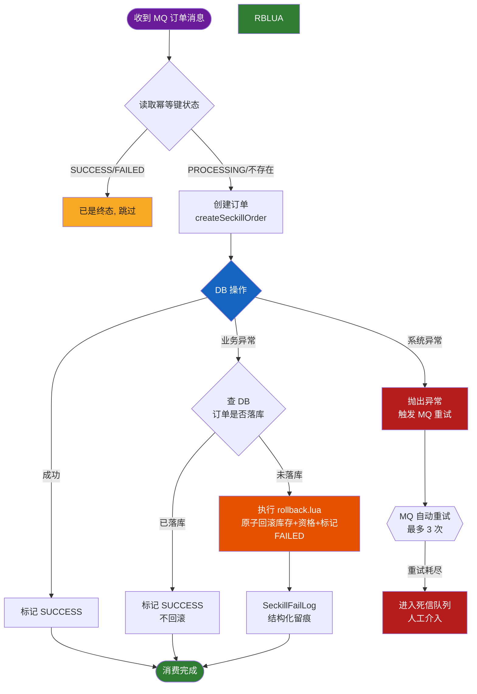

---

<div align="center">

# ⚡ FlashDeal

### 高并发秒杀系统 | High-Concurrency Flash Sale System

基于 **Spring Boot 3 + Redis + RocketMQ** 构建的高可用、防超卖、防重复下单的秒杀系统

[](https://openjdk.org/)
[](https://spring.io/projects/spring-boot)
[](https://redis.io/)
[](https://rocketmq.apache.org/)
[](https://baomidou.com/)
[](LICENSE)

</div>

---

## 📖 项目简介

**FlashDeal** 是一个面向高并发场景的秒杀系统，核心解决电商促销、限量抢购等业务中常见的三大难题：**超卖**、**重复下单**、*
*流量洪峰**。系统通过 Redis Lua 脚本实现原子性库存预扣减，借助 RocketMQ 完成订单异步落库，并使用 Redisson 限流器保障系统稳定性。

整体设计遵循"**前置拦截 → 原子预扣 → 异步落库 → 失败补偿**"
的分层防御理念，单机可支撑每秒数千次秒杀请求，在保证业务正确性的同时最大化吞吐能力。项目代码结构清晰、注释完善，既可作为生产级秒杀方案的参考实现，也适合作为学习高并发架构设计的实战案例。

---

## ✨ 核心特性

| 特性             | 实现方式                              | 说明                                                                     |
|:---------------|:----------------------------------|:-----------------------------------------------------------------------|
| 🚀 **流量整形**    | Redisson `RRateLimiter`           | 全局限流 3000 req/s，超出直接拒绝，压测中拦截 87% 请求                                    |
| 🔐 **登录鉴权**    | JWT + 拦截器                         | 无状态认证，Token 有效期 2 小时                                                   |
| ⚡ **原子预扣**     | Redis Lua 脚本                      | `sadd` 判重 + `decr` 扣减原子完成，避免竞态（已购用户集合 orderKey 的 TTL 在 Java 层设置为 30 天） |
| 🆔 **全局唯一 ID** | Hutool Snowflake                  | 41 位时间戳 + 10 位机器 ID + 12 位序列号，趋势递增，支持分布式                               |
| 🗄️ **库存预热**   | `@PostConstruct` 自动加载             | 应用启动时自动将 DB 秒杀库存同步到 Redis （目前代码仅限测试使用）                                 |
| 📨 **异步落库**    | RocketMQ 异步发送                     | Redis 预扣成功后异步写 DB；SeckillProducer 在内部捕获 asyncSend 的异常并处理               |
| 🔒 **DB 乐观锁**  | `WHERE stock > 0`                 | 数据库层兜底，防止超卖与重复下单                                                       |
| 🛡️ **三态幂等**   | Redis `PROCESSING/SUCCESS/FAILED` | 消费端三态幂等键，支持 MQ 重试与前端状态轮询                                               |
| 💥 **超卖防御**    | DB 乐观锁 `stock > 0`                | `UPDATE ... SET stock = stock - 1 WHERE stock > 0`                     |
| 🔄 **失败补偿**    | Redis Lua 原子回滚 + 结构化留痕            | MQ 发送失败 / 消费业务异常时原子回滚库存，失败记录便于人工核查                                     |

---

## 🛠️ 技术栈

| 分类         | 技术              | 版本          |
|:-----------|:----------------|:------------|
| **基础框架**   | Spring Boot     | 3.5.16      |
| **开发语言**   | Java            | 17          |
| **ORM 框架** | MyBatis Plus    | 3.5.16      |
| **关系型数据库** | MySQL           | 8.0+        |
| **缓存中间件**  | Redis           | 7.0+        |
| **限流**     | Redisson        | 3.27.0      |
| **消息队列**   | Apache RocketMQ | 4.9.7       |
| **认证授权**   | JWT             | 0.12.6      |
| **工具库**    | Hutool / Lombok | 5.8.34 / -- |

---

## 🏗️ 系统架构

下图展示了 FlashDeal 的整体架构与各组件协作关系。客户端请求经过限流器与登录拦截器后进入业务层，业务层通过 Redis 完成原子预扣，再通过
RocketMQ 异步落库，最终由消费者在幂等校验与 DB 乐观锁保护下写入 MySQL。


```mermaid
flowchart TB
    subgraph Client["客户端"]
        U["用户 App / Web"]
    end

    subgraph Gateway["接入层"]
        RL["Redisson 限流器<br/>3000 req/s"]
        LI["JWT 登录拦截器"]
    end

    subgraph App["应用层 Spring Boot"]
        CTRL["SeckillController"]
        SVC["SeckillServiceImpl"]
        IDG["SnowflakeIdGenerate<br/>全局唯一 ID"]
        PROD["SeckillProducer"]
        CONS["SeckillConsumer"]
    end

    subgraph Cache["缓存层 Redis"]
        STOCK[("seckill:{id}:stock<br/>库存")]
        ORDER[("seckill:{id}:order<br/>已购用户 Set")]
        IDEM[("seckill:{userId}:{voucherId}:consumed<br/>三态幂等键")]

        LUA["Lua 脚本<br/>原子预扣"]
        RBLUA["rollback.lua<br/>原子回滚"]
    end

    subgraph MQ["消息队列"]
        TOPIC[["voucher-order-topic"]]
    end

    subgraph DB["持久层"]
        MYSQL[("MySQL<br/>tb_voucher<br/>tb_seckill_voucher<br/>tb_voucher_order<br/>user")]
    end

    U -->|HTTP 请求| RL
    RL -->|放行| LI
    RL -->|超限| REJ["拒绝: 系统繁忙"]
    LI -->|Token 校验通过| CTRL
    LI -->|无 Token/失效| UNAUTH["401 未登录"]
    CTRL --> SVC
    SVC --> IDG

    SVC -->|执行| LUA
    LUA --> STOCK
    LUA --> ORDER
    SVC -->|预扣成功| PROD
    PROD -->|同步发送| TOPIC
    PROD -.->|发送失败| RBLUA
    RBLUA --> STOCK
    RBLUA --> ORDER
    TOPIC --> CONS
    CONS -->|终态判断| IDEM
    CONS -->|DB 操作| MYSQL
    MYSQL -->|stock=stock-1<br/>WHERE stock>0| MYSQL

    style RL fill:#e65100,color:#fff
    style LUA fill:#2e7d32,color:#fff
    style TOPIC fill:#1565c0,color:#fff
    style MYSQL fill:#c62828,color:#fff
    style REJ fill:#b71c1c,color:#fff
    style UNAUTH fill:#b71c1c,color:#fff
```

---

## ⚡ 秒杀核心流程

下图展示了从用户点击"立即抢购"到订单创建完成的完整链路，包含限流、鉴权、Lua 原子预扣、MQ
异步发送、失败回滚等关键环节。这是整个系统最核心的流程，所有的高并发设计都集中体现在这里。


```mermaid
flowchart TD
    START([用户发起秒杀请求]) --> LIMIT{限流器<br/>tryAcquire}
    LIMIT -->|被限流| R1[返回: 系统繁忙]
    LIMIT -->|放行| AUTH{JWT 校验}
    AUTH -->|未登录| R2[返回: 401 未登录]
    AUTH -->|已登录| GEN[生成全局唯一订单 ID<br/>Snowflake]

    GEN --> LUA[执行 Lua 脚本<br/>原子操作]
    LUA --> CHECK1{库存 > 0?}
    CHECK1 -->|否| R3[返回: 优惠券已卖完<br/>Lua 返回 1]
    CHECK1 -->|是| CHECK2{用户已下单?<br/>sadd 判重}
    CHECK2 -->|是| R4[返回: 不能重复下单<br/>Lua 返回 2]
    CHECK2 -->|否| DECR[sadd 记录用户<br/>decr 扣减库存<br/>Lua 返回 0]

    DECR --> BUILD[构建订单对象<br/>VoucherOrder]
    BUILD --> MARK[标记 PROCESSING<br/>写入三态幂等键]
    MARK --> MQ{同步发送 RocketMQ<br/>超时 5s}
    MQ -->|发送成功| OK[返回: 处理中<br/>前端轮询状态]
    MQ -->|发送失败| ROLLBACK[执行 rollback.lua<br/>原子回滚库存+资格+状态]
    ROLLBACK --> R5[返回: 系统繁忙<br/>请稍后重试]

    style START fill:#6a1b9a,color:#fff
    style OK fill:#2e7d32,color:#fff
    style R1 fill:#b71c1c,color:#fff
    style R2 fill:#b71c1c,color:#fff
    style R3 fill:#b71c1c,color:#fff
    style R4 fill:#b71c1c,color:#fff
    style R5 fill:#b71c1c,color:#fff
    style LUA fill:#f9a825,color:#212121
    style DECR fill:#1565c0,color:#fff
    style ROLLBACK fill:#e65100,color:#fff
```

---

## 📨 MQ 消费与补偿流程

下图展示了 RocketMQ 消费者侧的处理逻辑。消费者收到订单消息后，先做幂等校验，再在 DB 乐观锁保护下完成 DB
落库。若发生业务异常（如库存不足、重复下单），会自动回滚 Redis 预扣的库存，保证 Redis 与 DB 数据最终一致。


```mermaid
flowchart TD
    MSG([收到 MQ 订单消息]) --> STATUS{读取幂等键状态}
    STATUS -->|SUCCESS/FAILED| SKIP[已是终态, 跳过]
    STATUS -->|PROCESSING/不存在| CREATE[创建订单<br/>createSeckillOrder]

    CREATE --> DBSAVE{DB 操作}
    DBSAVE -->|成功| MARK[标记 SUCCESS]
    MARK --> DONE([消费完成])

    DBSAVE -->|业务异常| CHECK{查 DB<br/>订单是否落库}
    CHECK -->|已落库| MARK2[标记 SUCCESS<br/>不回滚]
    MARK2 --> DONE
    CHECK -->|未落库| RBLUA2[执行 rollback.lua<br/>原子回滚库存+资格+标记FAILED]
    RBLUA2 --> RECORD[SeckillFailLog<br/>结构化留痕]
    RECORD --> DONE

    DBSAVE -->|系统异常| THROW1[抛出异常<br/>触发 MQ 重试]
    THROW1 --> RETRY{{MQ 自动重试<br/>最多 3 次}}
    RETRY -->|重试耗尽| DLQ[进入死信队列<br/>人工介入]

    style MSG fill:#6a1b9a,color:#fff
    style DONE fill:#2e7d32,color:#fff
    style SKIP fill:#f9a825,color:#212121
    style THROW1 fill:#b71c1c,color:#fff
    style DLQ fill:#b71c1c,color:#fff
    style RBLUA fill:#2e7d32,color:#fff
    style RBLUA2 fill:#e65100,color:#fff
    style DBSAVE fill:#1565c0,color:#fff
```

---

## 📁 项目结构

```
FlashDeal
├── pom.xml                                      # Maven 依赖与构建配置
├── scripts/                                     # 压测脚本
│   ├── seckill_test.sh                          # wrk 秒杀压测主脚本
│   ├── single_user_test.sh                      # 单用户压测脚本
│   ├── wrk_seckill_multi_user.lua               # wrk Lua 压测脚本
│   ├── testData.txt                             # 测试数据
│   └── tokens.txt                               # 用户 Token 文件
├── src
│   ├── main
│   │   ├── java/com/flashdeal
│   │   │   ├── FlashDealApplication.java        # 启动类
│   │   │   ├── controller/                      # 控制层
│   │   │   │   ├── UserController.java          # 用户登录
│   │   │   │   ├── SeckillController.java       # 秒杀下单+状态查询入口
│   │   │   │   └── TestController.java          # 测试: 添加秒杀券
│   │   │   ├── service/                         # 服务层
│   │   │   │   ├── UserService.java
│   │   │   │   ├── SeckillVoucherService.java
│   │   │   │   ├── SeckillService.java
│   │   │   │   └── impl/
│   │   │   │       ├── UserServiceImpl.java
│   │   │   │       ├── SeckillVoucherServiceImpl.java   # 添加秒杀券+同步库存到Redis
│   │   │   │       └── SeckillServiceImpl.java          # ⭐ 秒杀核心逻辑
│   │   │   ├── rocketmq/                        # MQ 生产/消费
│   │   │   │   ├── SeckillProducer.java         # 异步发送+失败回滚
│   │   │   │   ├── SeckillConsumer.java         # 幂等消费+失败回滚
│   │   │   │   └── SeckillFailLog.java          # 失败核查记录实体
│   │   │   ├── mapper/                          # MyBatis Plus Mapper
│   │   │   ├── domain/                          # 实体与 DTO/VO
│   │   │   │   ├── User.java
│   │   │   │   ├── SeckillVoucher.java
│   │   │   │   ├── SeckillOrder.java
│   │   │   │   ├── Result.java                  # 统一返回结果
│   │   │   │   ├── dto/UserLoginDTO.java
│   │   │   │   └── vo/UserLoginVO.java
│   │   │   └── common/                          # 公共组件
│   │   │       ├── config/                      # 配置类
│   │   │       │   ├── RedisConfig.java
│   │   │       │   ├── RedissonConfig.java      # Redis 密码从配置读取
│   │   │       │   ├── MybatisPlusConfig.java
│   │   │       │   └── WebMvcConfig.java        # 拦截器+消息转换器
│   │   │       ├── constant/                    # 常量
│   │   │       │   ├── RedisKeyConstant.java
│   │   │       │   ├── MessageConstant.java
│   │   │       │   └── JwtClaimsConstant.java
│   │   │       ├── exception/                   # 异常处理
│   │   │       │   ├── BaseException.java
│   │   │       │   ├── BusinessException.java
│   │   │       │   ├── LoginFailedException.java
│   │   │       │   └── GlobalExceptionHandler.java
│   │   │       ├── interceptor/                 # 拦截器
│   │   │       │   ├── RateLimitInterceptor.java # 限流拦截器（最先执行）
│   │   │       │   └── LoginInterceptor.java     # JWT 登录拦截器
│   │   │       ├── utils/                       # 工具类
│   │   │       │   ├── JwtUtil.java
│   │   │       │   ├── SnowflakeIdGenerate.java # 雪花算法全局唯一 ID
│   │   │       │   ├── LuaScriptUtil.java       # Lua 脚本加载器
│   │   │       │   └── UserHolder.java          # ThreadLocal 用户上下文
│   │   │       ├── properties/JwtProperties.java
│   │   │       └── json/JacksonObjectMapper.java
│   │   └── resources/
│   │       ├── application.yaml                 # 应用配置
│   │       ├── application-dev.yaml               # 开发环境配置
│   │       ├── mapper/UserMapper.xml
│   │       └── lua/
│   │           ├── seckill.lua              # ⭐ 秒杀预扣 Lua 脚本
│   │           └── rollback.lua             # ⭐ 失败回滚 Lua 脚本
│   └── test/java/com/flashdeal/FlashDealApplicationTests.java
```

---

## 🚀 快速开始

### 环境准备

| 依赖       | 最低版本  | 说明   |
|:---------|:------|:-----|
| JDK      | 17    | 必须   |
| Maven    | 3.8+  | 构建工具 |
| MySQL    | 8.0+  | 数据存储 |
| Redis    | 7.0+  | 缓存   |
| RocketMQ | 4.9.7 | 消息队列 |

### 1. 初始化数据库

```sql
-- 用户表
CREATE TABLE `user`
(
    `id`          BIGINT NOT NULL AUTO_INCREMENT,
    `openid`      VARCHAR(64)  DEFAULT NULL,
    `name`        VARCHAR(64)  DEFAULT NULL,
    `phone`       VARCHAR(32)  DEFAULT NULL,
    `sex`         VARCHAR(4)   DEFAULT NULL,
    `id_number`   VARCHAR(32)  DEFAULT NULL,
    `avatar`      VARCHAR(255) DEFAULT NULL,
    `create_time` DATETIME     DEFAULT NULL,
    PRIMARY KEY (`id`),
    UNIQUE KEY `uk_phone` (`phone`)
) ENGINE = InnoDB
  DEFAULT CHARSET = utf8mb4;

-- 优惠券表
CREATE TABLE `tb_voucher`
(
    `id`           BIGINT NOT NULL AUTO_INCREMENT,
    `title`        VARCHAR(128)  DEFAULT NULL,
    `sub_title`    VARCHAR(128)  DEFAULT NULL,
    `rules`        VARCHAR(1024) DEFAULT NULL,
    `pay_value`    BIGINT        DEFAULT NULL,
    `actual_value` BIGINT        DEFAULT NULL,
    `type`         INT           DEFAULT NULL,
    `status`       INT           DEFAULT NULL,
    `create_time`  DATETIME      DEFAULT NULL,
    `update_time`  DATETIME      DEFAULT NULL,
    PRIMARY KEY (`id`)
) ENGINE = InnoDB
  DEFAULT CHARSET = utf8mb4;

-- 秒杀优惠券表
CREATE TABLE `tb_seckill_voucher`
(
    `voucher_id`  BIGINT NOT NULL,
    `stock`       INT    NOT NULL,
    `create_time` DATETIME DEFAULT NULL,
    `begin_time`  DATETIME DEFAULT NULL,
    `end_time`    DATETIME DEFAULT NULL,
    `update_time` DATETIME DEFAULT NULL,
    PRIMARY KEY (`voucher_id`)
) ENGINE = InnoDB
  DEFAULT CHARSET = utf8mb4;

-- 优惠券订单表
CREATE TABLE `tb_voucher_order`
(
    `id`          BIGINT NOT NULL,
    `user_id`     BIGINT NOT NULL,
    `voucher_id`  BIGINT NOT NULL,
    `pay_type`    INT      DEFAULT NULL,
    `status`      INT      DEFAULT NULL,
    `create_time` DATETIME DEFAULT NULL,
    `pay_time`    DATETIME DEFAULT NULL,
    `use_time`    DATETIME DEFAULT NULL,
    `refund_time` DATETIME DEFAULT NULL,
    `update_time` DATETIME DEFAULT NULL,
    PRIMARY KEY (`id`),
    UNIQUE KEY `uk_user_voucher` (`user_id`, `voucher_id`)
) ENGINE = InnoDB
  DEFAULT CHARSET = utf8mb4;
```

### 2. 修改配置

编辑 `src/main/resources/application-dev.yaml`，按实际环境调整 MySQL、Redis、RocketMQ 地址：

```yaml
spring:
  datasource:
    url: jdbc:mysql://localhost:3306/flashdeal?sslMode=DISABLED&serverTimezone=Asia/Shanghai
    username: root
    password: your_password
    driver-class-name: com.mysql.cj.jdbc.Driver
  data:
    redis:
      host: localhost
      port: 6379
      database: 0
      # password: your_password  # 如 Redis 有密码请取消注释

rocketmq:
  name-server: localhost:9876
  producer:
    group: voucherorder_group
```

### 3. 启动中间件

```bash
# 启动 Redis
redis-server --daemonize yes

# 启动 RocketMQ NameServer 与 Broker（需在 RocketMQ 安装目录执行）
nohup sh bin/mqnamesrv &
nohup sh bin/mqbroker -n localhost:9876 &
```

### 4. 构建与运行

```bash
# 编译打包
mvn clean package -DskipTests

# 运行
java -jar target/FlashDeal-1.0.0.jar

# 或开发模式
mvn spring-boot:run
```

应用启动后监听 **8080** 端口。

---

## 📡 接口文档

### 用户登录

```http
POST /user/login
Content-Type: application/json

{
  "phone": "13800138000"
}
```

**响应示例：**

```json
{
  "code": 1,
  "msg": null,
  "data": {
    "id": 1,
    "phone": "13800138000",
    "token": "eyJhbGciOiJIUzI1NiJ9..."
  }
}
```

### 添加秒杀优惠券（测试用）

```http
POST /test/voucher/seckill
Content-Type: application/json

{
  "title": "100元代金券",
  "subTitle": "限时秒杀",
  "payValue": 8000,
  "actualValue": 10000,
  "type": 1,
  "status": 1,
  "stock": 100,
  "beginTime": "2026-06-29T10:00:00",
  "endTime": "2026-06-29T12:00:00"
}
```

### 秒杀下单（核心接口）

```http
POST /user/seckill/{id}
Authorization: Bearer <登录返回的 token>
```

**响应示例：**

**成功（异步处理中）：**

```json
{
  "code": 1,
  "msg": null,
  "data": "处理中"
}
```

> 秒杀接口返回"处理中"后，前端通过状态查询接口轮询最终结果。

### 查询秒杀订单状态

```http
GET /user/seckill/status/{voucherId}
Authorization: Bearer <登录返回的 token>
```

**响应示例：**

```json
{
  "code": 1,
  "msg": null,
  "data": "SUCCESS"
}
```

**状态说明：**

| 状态           | 含义            |
|:-------------|:--------------|
| `PROCESSING` | 订单正在处理中       |
| `SUCCESS`    | 订单创建成功        |
| `FAILED`     | 订单创建失败（已回滚库存） |
| `UNKNOWN`    | 订单不存在或状态已过期   |

**库存不足：**

```json
{
  "code": 0,
  "msg": "优惠券已卖完",
  "data": null
}
```

**重复下单：**

```json
{
  "code": 0,
  "msg": "不能重复下单",
  "data": null
}
```

**限流/系统繁忙：**

```json
{
  "code": 0,
  "msg": "当前系统繁忙，请稍后重试",
  "data": null
}
```

---

## 🔑 关键设计解析

### 1. Lua 脚本原子操作

秒杀场景下，库存校验、去重、库存扣减如果分开执行，会出现并发竞态。本项目通过两个 Lua 脚本分别覆盖正向预扣与失败回滚，所有操作在
Redis 单线程内原子完成：

```lua
-- lua/seckill.lua — 原子预扣
if (tonumber(redis.call('get', stockKey) or 0) <= 0) then
    return 1                    -- 库存不足
end
if (redis.call('sadd', orderKey, userId) == 0) then
    return 2                    -- sadd 返回 0，用户已在集合中，重复下单
end
redis.call('decr', stockKey)    -- 扣减库存
return 0                        -- 成功
```

```lua
-- lua/rollback.lua — 原子回滚（mode: DELETE 清除状态 / FAIL 标记失败）
redis.call('incr', stockKey)              -- 回补库存
redis.call('srem', orderKey, userId)      -- 移除用户购买记录
if mode == "DELETE" then
    redis.call('del', idempotencyKey)     -- MQ 发送失败：清除幂等键
    return 1
end

-- FAIL 模式：标记失败并设置过期时间
redis.call('set', idempotencyKey, "FAILED", "EX", tonumber(ttlSeconds))
return 1
```

> 预扣脚本先 `sadd` 再 `decr`，相比 `sismember` + `sadd` + `decr` 三步，减少一次 Redis 调用，同时利用 `sadd` 的返回值天然完成判重。

### 2. 全局唯一订单 ID

订单 ID 不能用 MySQL 自增（分库分表场景会冲突），也不能用 UUID（无序，影响 B+ 树插入性能）。本项目采用 **Hutool Snowflake 雪花算法
**：

```
|  1 bit 符号位  |  41 bit 时间戳  |  10 bit 机器 ID  |  12 bit 序列号  |
```

- 41 位时间戳：毫秒级，可用约 69 年
- 10 位机器 ID：支持 1024 个节点（单机部署写死 0，分布式场景从配置中心读取）
- 12 位序列号：同一毫秒内最多生成 4096 个 ID

趋势递增、本地生成、性能极高，天然适合高并发订单号场景。

### 3. Redis 与 DB 最终一致性

系统采用"**Redis 预扣 + MQ 异步落库**"模式，Redis 是库存的"快"视图，DB 是"真"数据源。一致性保障措施：

- **MQ 同步发送**：发送成功才返回"处理中"，发送失败通过 `rollback.lua` 原子回滚 Redis（库存+资格+幂等键一次完成）
- **三态幂等**：`PROCESSING/SUCCESS/FAILED` 三态设计，支持 MQ 重试与前端状态轮询
- **终态判断**：消费端读取幂等键状态，只有终态（SUCCESS/FAILED）才跳过，PROCESSING 继续处理
- **DB 乐观锁兜底**：`WHERE stock > 0` 防止超卖，DB 层再次校验防重复
- **业务异常分级**：确定性失败（BusinessException）直接终结并通过 `rollback.lua` 原子回滚；偶发性失败抛出让 MQ 重试
- **订单落库检查**：`handleFail` 先查 DB 确认订单状态，已落库则不回滚，未落库通过 `rollback.lua` 原子回滚库存
- **Redis 异常降级**：Redis 连接异常时直接返回"系统繁忙"，避免请求堆积压垮 DB

### 4. 分层防御体系

- **第一层（入口限流）**：Redisson `RRateLimiter` 全局限流 3000 req/s，超出直接返回"系统繁忙"
- **第二层（快速失败）**：Redis Lua 脚本原子预扣，瞬间拒绝无库存/重复请求，不进入后续流程
- **第三层（数据兜底）**：DB 乐观锁 `WHERE stock > 0` 确保最终数据一致性，防止超卖

---

## 📊 性能指标

| 指标     | 数值                                   | 说明                                  |
|:-------|:-------------------------------------|:------------------------------------|
| 系统吞吐   | ~23000 req/s                         | 200 连接压测实测，限流拦截 87% 后放行约 3000 req/s |
| 平均响应时间 | ~10ms                                | Redis 预扣 + MQ 同步发送                  |
| wrk 压测 | 200 连接 / 8 线程，696K+ 请求，P99 = 35.59ms | 本地 30s benchmark 实测数据               |
| 超卖防护   | 理论可完全避免                              | Lua 原子操作 + DB 乐观锁双重保障               |
| 重复下单防护 | 理论可完全避免                              | Redis Set + DB 乐观锁 + DB 唯一索引        |

---

## 🧪 压测脚本

项目内置 `wrk` 压测脚本，位于 `scripts/` 目录：

```bash
# 进入脚本目录
cd scripts/

# 给脚本添加执行权限
chmod +x seckill_test.sh single_user_test.sh

# 执行多用户秒杀压测（需先准备 tokens.txt）
./seckill_test.sh
```

压测脚本会自动：

1. 从 `tokens.txt` 读取用户 Token
2. 使用 `wrk` 多线程并发请求秒杀接口
3. 输出压测统计结果（QPS、延迟分布等）

---

## 🗺️ 路线图

- [x] 用户登录与 JWT 鉴权
- [x] 秒杀优惠券管理
- [x] Redis Lua 原子预扣
- [x] RocketMQ 异步落库
- [x] DB 乐观锁防重复
- [x] 三态幂等与状态查询接口
- [x] 失败补偿与 Lua 原子回滚
- [x] 结构化失败留痕（SeckillFailLog）
- [x] 接口压测脚本（wrk）
- [ ] Docker Compose 一键部署
- [ ] Prometheus + Grafana 监控
- [ ] 秒杀券预热与活动管理后台

---

## 📄 License

本项目基于 [MIT License](https://opensource.org/licenses/MIT) 开源，欢迎学习、交流与二次开发。

---

<div align="center">

**如果这个项目对你有帮助，欢迎 ⭐ Star 支持！**

</div>
